# Integration Architecture
## Court Action AI - System Design & Data Flow

---

## 🏛️ System Architecture

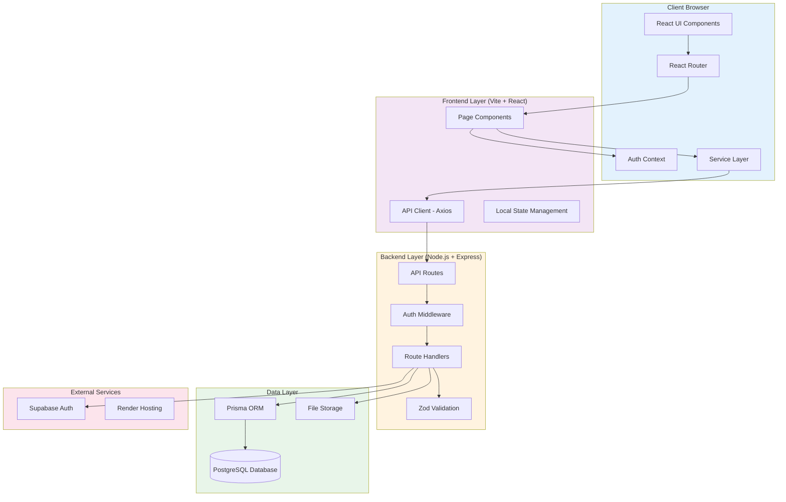

---

## 🔄 Authentication Flow

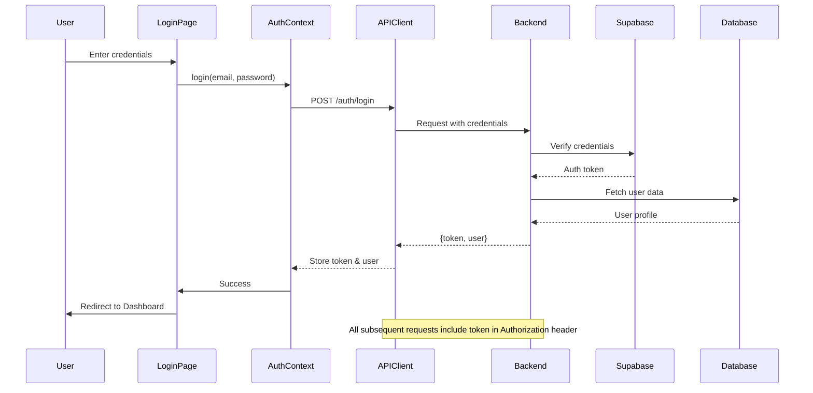

---

## 📊 Data Flow - Case Upload

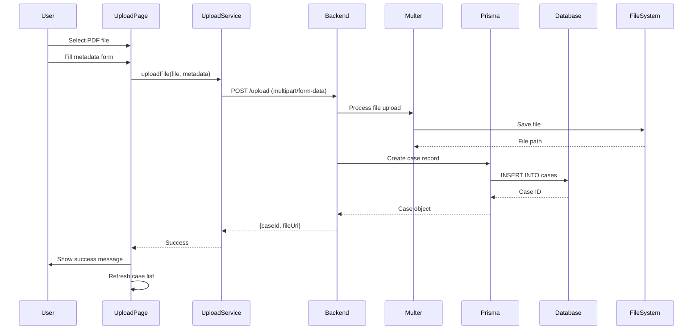

---

## 🔍 Data Flow - AI Workspace

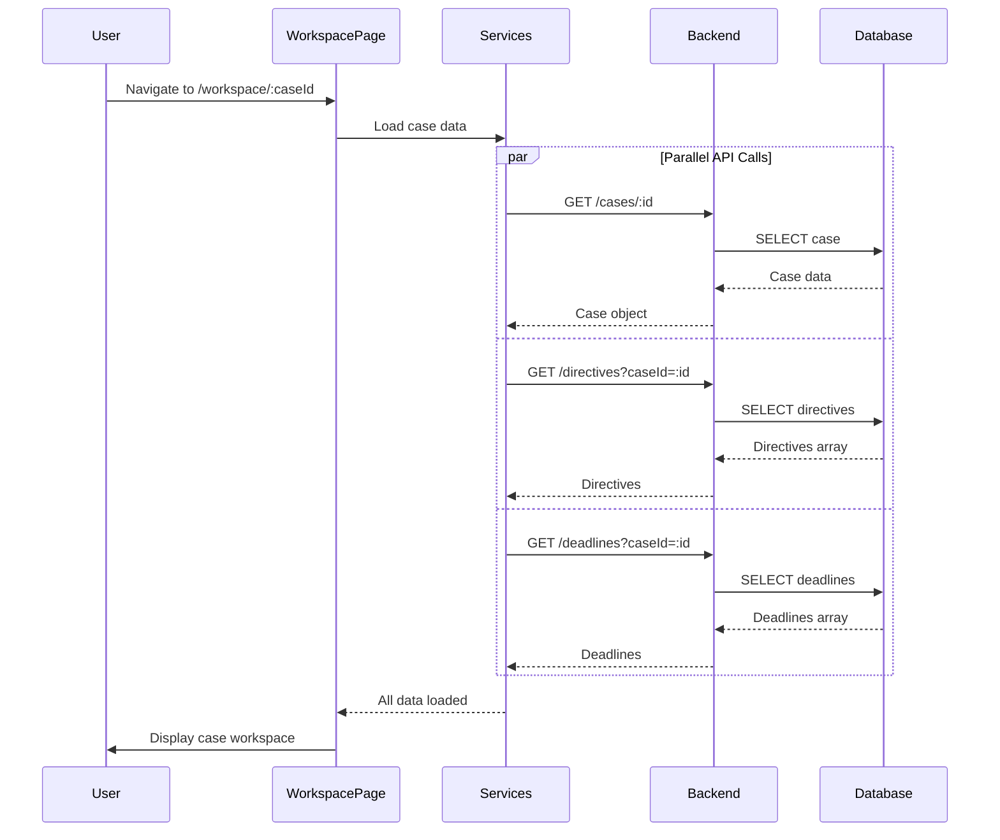

---

## ✅ Data Flow - Verification

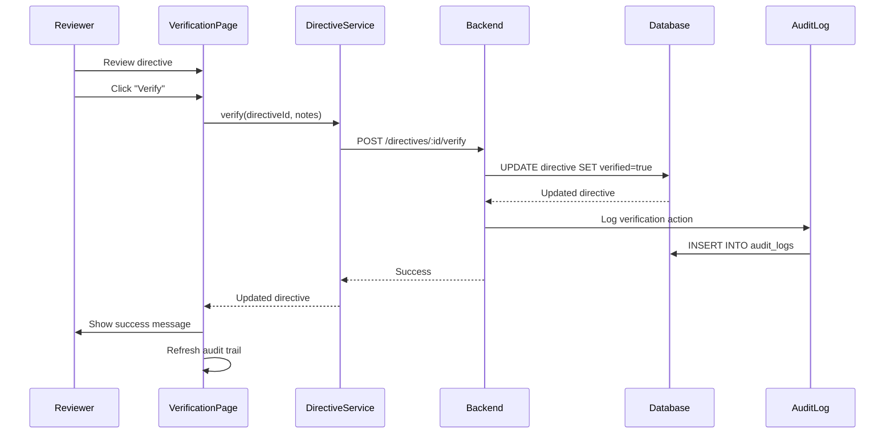

---

## 📈 Data Flow - Governance Dashboard

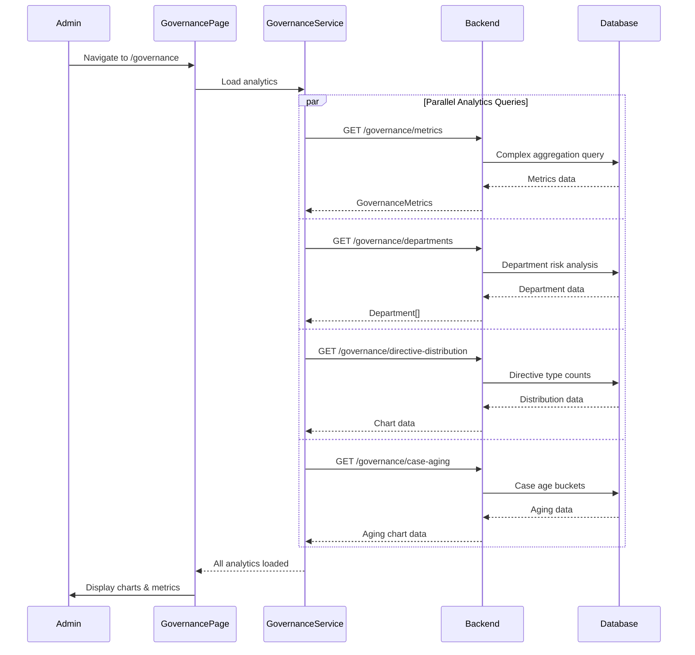

---

## 🗄️ Database Schema Overview

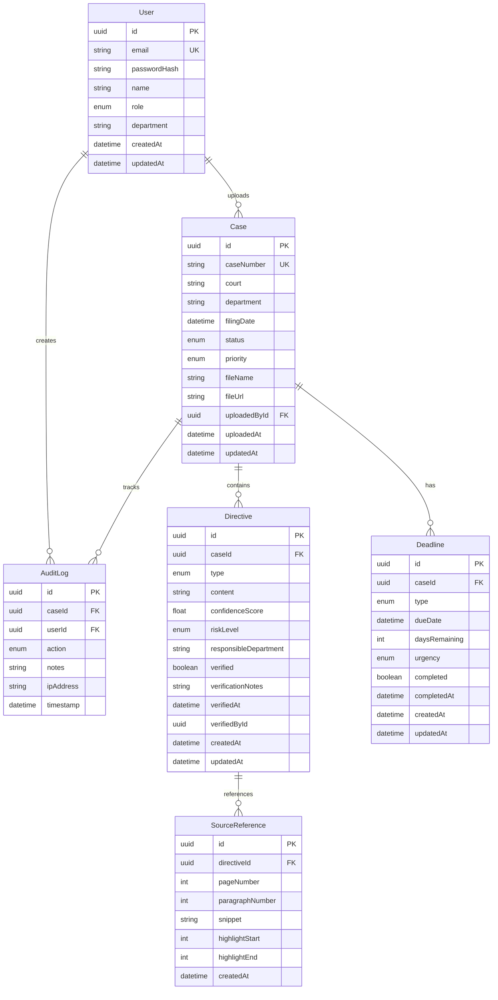

---

## 🔐 Security Architecture

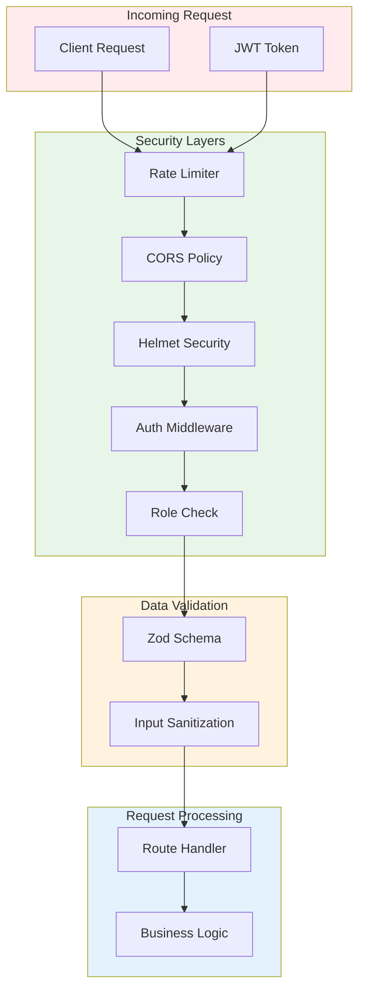

---

## 🚀 Deployment Architecture (Render)

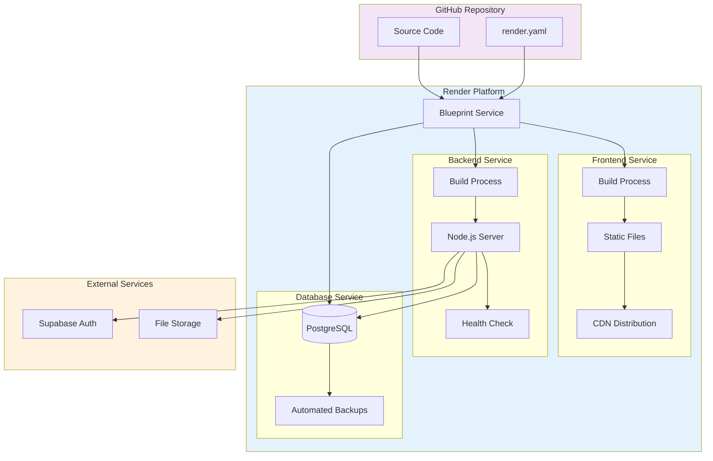

---

## 📱 Component Hierarchy

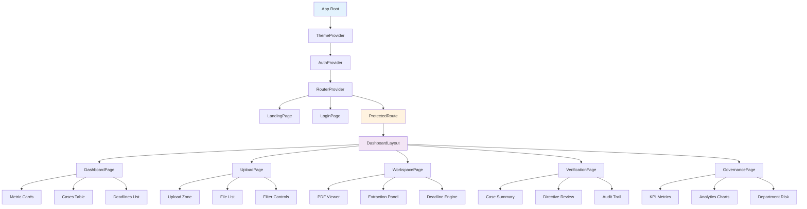

---

## 🔄 State Management Flow

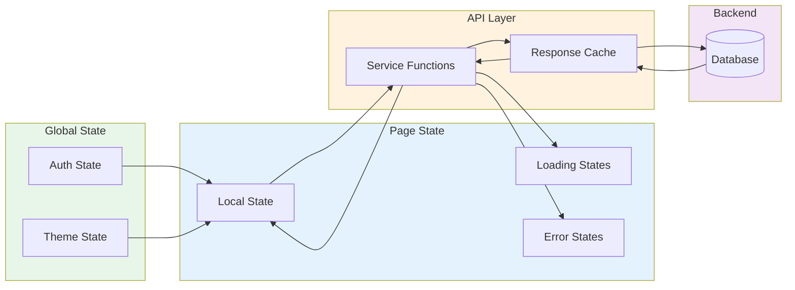

---

## 📦 Build & Deployment Pipeline

```mermaid
graph LR
    subgraph Development["Development"]
        Code[Write Code]
        Test[Local Testing]
        Commit[Git Commit]
    end
    
    subgraph CI["Continuous Integration"]
        Push[Git Push]
        Trigger[Render Webhook]
        Build[Build Process]
    end
    
    subgraph Backend["Backend Build"]
        BInstall[npm install]
        BPrisma[Prisma Generate]
        BCompile[TypeScript Compile]
        BDist[dist/ Output]
    end
    
    subgraph Frontend["Frontend Build"]
        FInstall[npm install]
        FCompile[Vite Build]
        FDist[dist/ Output]
    end
    
    subgraph Deploy["Deployment"]
        BDeploy[Backend Deploy]
        FDeploy[Frontend Deploy]
        DBMigrate[DB Migration]
        Health[Health Check]
    end
    
    Code --> Test
    Test --> Commit
    Commit --> Push
    Push --> Trigger
    Trigger --> Build
    
    Build --> BInstall
    Build --> FInstall
    
    BInstall --> BPrisma
    BPrisma --> BCompile
    BCompile --> BDist
    BDist --> BDeploy
    
    FInstall --> FCompile
    FCompile --> FDist
    FDist --> FDeploy
    
    BDeploy --> DBMigrate
    FDeploy --> Health
    DBMigrate --> Health
    
    style Development fill:#e3f2fd
    style CI fill:#f3e5f5
    style Backend fill:#fff3e0
    style Frontend fill:#e8f5e9
    style Deploy fill:#fce4ec
```

---

## 🎯 API Endpoint Map

### Authentication Endpoints
- `POST /api/auth/register` - User registration
- `POST /api/auth/login` - User login
- `POST /api/auth/logout` - User logout
- `GET /api/auth/me` - Get current user

### Case Management Endpoints
- `GET /api/cases` - List all cases (paginated)
- `GET /api/cases/:id` - Get case by ID
- `POST /api/cases` - Create new case
- `PATCH /api/cases/:id` - Update case
- `DELETE /api/cases/:id` - Delete case

### Directive Endpoints
- `GET /api/directives` - List directives (filter by caseId)
- `POST /api/directives` - Create directive
- `PATCH /api/directives/:id` - Update directive
- `POST /api/directives/:id/verify` - Verify directive

### Deadline Endpoints
- `GET /api/deadlines` - List deadlines (filter by caseId)
- `POST /api/deadlines` - Create deadline
- `PATCH /api/deadlines/:id` - Update deadline

### Upload Endpoint
- `POST /api/upload` - Upload PDF file

### Governance Endpoints
- `GET /api/governance/metrics` - Dashboard KPIs
- `GET /api/governance/departments` - Department risk data
- `GET /api/governance/directive-distribution` - Directive type distribution
- `GET /api/governance/case-aging` - Case aging analysis

### Audit Log Endpoints
- `GET /api/audit-logs` - List all audit logs
- `GET /api/audit-logs/case/:caseId` - Get logs for specific case

---

## 🔧 Technology Stack

### Frontend
- **Framework**: React 18 + TypeScript
- **Build Tool**: Vite
- **Routing**: React Router v6
- **HTTP Client**: Axios
- **UI Components**: Radix UI + Tailwind CSS
- **Charts**: Recharts
- **Forms**: React Hook Form + Zod
- **Notifications**: Sonner

### Backend
- **Runtime**: Node.js
- **Framework**: Express
- **Language**: TypeScript
- **ORM**: Prisma
- **Database**: PostgreSQL
- **Authentication**: Supabase Auth
- **Validation**: Zod
- **File Upload**: Multer
- **Security**: Helmet, CORS, Rate Limiting

### DevOps
- **Hosting**: Render
- **Database**: Render PostgreSQL
- **Version Control**: Git + GitHub
- **CI/CD**: Render Auto-Deploy

---

This architecture document provides a comprehensive visual overview of the entire system. Use it alongside the implementation plan for a complete understanding of the integration strategy.